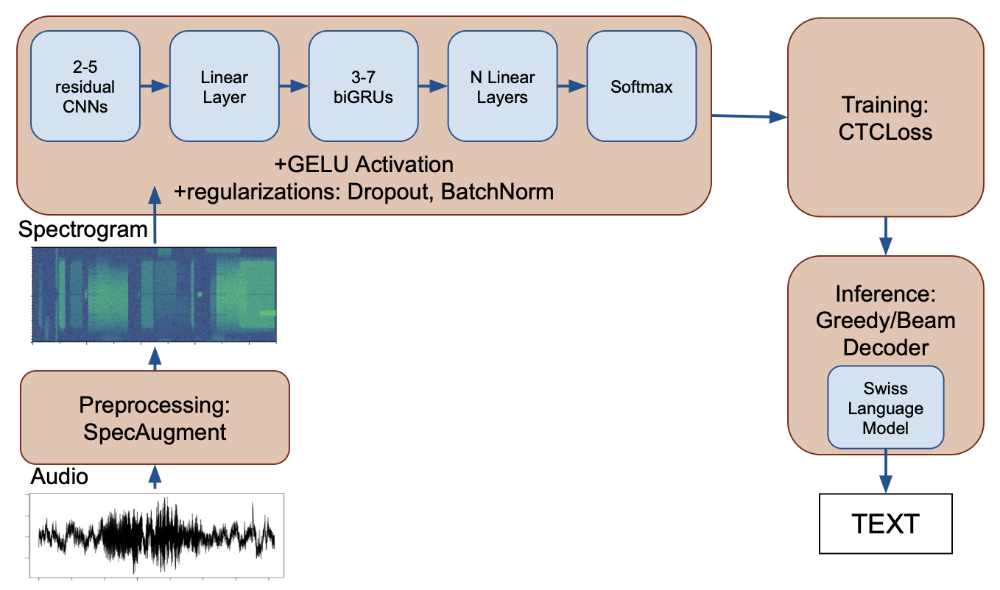
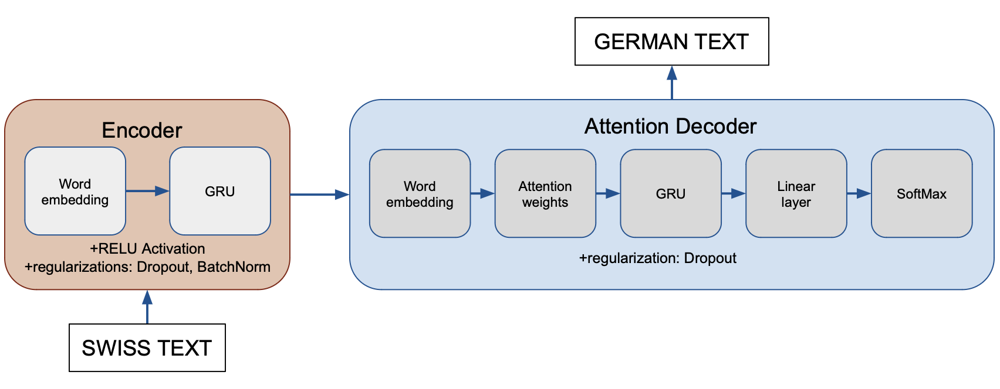

# speech-recognition-master-thesis
Speech recognition and Neural machine translation for Swiss German dialect

## Speech recognition 
Implements a DNN model training and inference for transcribing both into Swiss German and Srandard German with WER = 35% and CER = 14%
DNN model architecture:

## Neural Machine Translation
Implements a Seq2Seq Attention model to translate the Swiss German into the Standard German with BLEU = 58.9
Implements SpellChecker to check if Swiss German can be transcribed into German easier
Seq2Seq Attention model architecture

## Files
1. Substitution of numbers in text; spell_numbers_in_german.ipynb
3. Main jupyter notebook with both data preparation and model training; audio_model_training_master_thesis.ipynb
4. Building and integration of KenLM Language Model;  kenlm-swiss-german.ipynb
5. Testing the sample audio data code;  beam_search_decoder_ASR_master_thesis.ipynb
6. Integration with TelegramBot, accomplished by Viktoryia Kananchuk.
7. Seq2seq Attn NMT model training and inference + spellchecker; seq2seq_translation_swiss.ipynb
